# A rapid and robust plate-based single cell ATAC-seq (scATAC-seq) method
This repository contains codes for processing and analysing scATAC-seq data for our manuscript. Click [here](https://www.nature.com/articles/s41467-018-07771-0) to read our paper published in Nature Communications.

## Why bother? What's the point of this method?

Here, I quote from the Dutch computer scientist [Edsger W. Dijkstra](https://en.wikiquote.org/wiki/Edsger_W._Dijkstra):

> <b>Simplicity is prerequisite for reliability.</b>

## Usage (two stages: data processing + data analysis)

### 1. Data processing (from fastq to data quality information and count matrix)

All steps are executed using the `Snakefile` in the corresponding directories. To start the workflow, download the fastq files from ArrayExpress ([E-MTAB-6714](https://www.ebi.ac.uk/arrayexpress/experiments/E-MTAB-6714/)), and put them in the fastq directories under `mSp_scATAC-seq/rep{1..11}/fastq/` and under `other_cells_methods/*/fastq`. Then run the pipeline using snakemake with the `Snakefile` provided, but change the path of certain files/programs in the `Snakefile` such as `picard.jar` according to your own environment.

For the processing of the ImmGen bulk ATAC-seq and the public Fluidigm C1 scATAC-seq experiments, download the raw data (url and study accession number provided in the correponding directories) into the fastq directory and run snakemake in the same way. Or, you can use [stream_ena](http://www.nxn.se/valent/streaming-rna-seq-data-from-ena) to avoid downloading fastq files to save space.

The notebooks `hek293t_nih3t3_mix_analysis.ipynb` and `technical_qc_and_methods_comprison.ipynb` contain basic information from the species mixing experiment, comparison of plate vs C1 using K562 and E14 mESC and experiments testd on other tissues and cells.

### 2. Data analysis (customised analysis depending on project aims)

Follow the notebook for the data analysis:

`1.mSp_exploratory_analysis_all.ipynb` contains information about the quality control and other basic information about all experiments.

`2.mSp_cell_type_identification.ipynb` is the analysis for the identification of different cell types in the mouse spleen based on the scATAC-seq profiles.

`3.mSp_motif_enrichment_analysis.ipynb` is used to generate the heatmap representation of known motifs enrichment by HOMER.

This repository only contains necessary files used to reproduce the analyses and figures. Raw data and any intermediate file are not included and can be generated from the `Data processing` stage. The count matrix `mSp_scATAC_count_matrix_over_all.mtx` is not in this repository, because it is too large. For now, download the count file from here: `ftp://ngs.sanger.ac.uk/production/teichmann/xi/plate_scATAC-seq`, and put it under `cmp_to_immgen/`, and the later analysis should run without any problem.

## Softwares/Packages

```
macs2 (v2.1.1.20160309) (this needs python2)
picard (v2.17.10)

# packages installed via conda:
#
# Name                    Version                   Build  Channel
bedtools                  2.27.1                        1    bioconda
cutadapt                  1.16                     py36_1    bioconda
hisat2                    2.1.0            py36pl5.22.0_0    bioconda
homer                     4.9.1                pl5.22.0_5    bioconda
matplotlib                3.0.0           py36h45c993b_1     conda-forge
numpy                     1.15.2          py36_blas_openblashd3ea46f_0  [blas_openblas]  conda-forge
pandas                    0.23.4           py36hf8a1672_0    conda-forge
salmon                    0.9.1                         1    bioconda
samtools                  1.7                           2    bioconda
scikit-learn              0.19.2          py36_blas_openblasha84fab4_201  [blas_openblas]  conda-forge
scipy                     1.1.0           py36_blas_openblash7943236_201  [blas_openblas]  conda-forge
seaborn                   0.9.0                      py_0    conda-forge
seqtk                     1.3                  ha92aebf_0    bioconda
snakemake                 5.3.0                    py36_1    bioconda
```

You also need `calc`, `addCols`, `bedClip` and `bedGraphToBigWig` from [UCSC utilities](http://hgdownload.soe.ucsc.edu/admin/exe/).

Finally, you need [bdg2bw](https://gist.github.com/taoliu/2469050) to convert the macs2 generated begraph to bigwig for visualisation.

## Experimental tips (not exactly science)

  * It is actually easier to do the experiment in 384-well plates if you have a 16-channel multi-channel pipette.

 

  * When pooling amplified single-cell libraries, you can use an 8-channel multi-channel pipette to transfer an entire 384-well plate into 8 wells of a deep-well 96-well plate. Since all single-cell libraries are already indexed here, you don't need to change tips (like shown below). After that, you will end up with slightly more than 900 ul mix in each deep well. Then, use a P1000 Gilson to transfer those ~900 ul x 8 = ~7.2 ml libary mix into a 50 ml falcon tube.

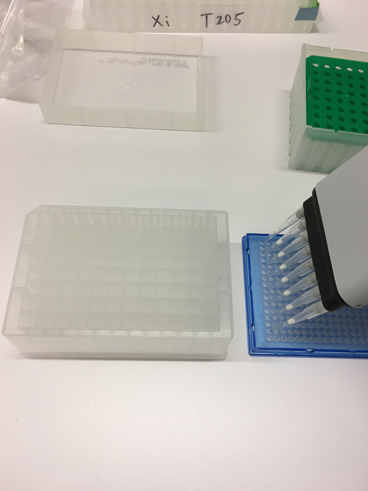 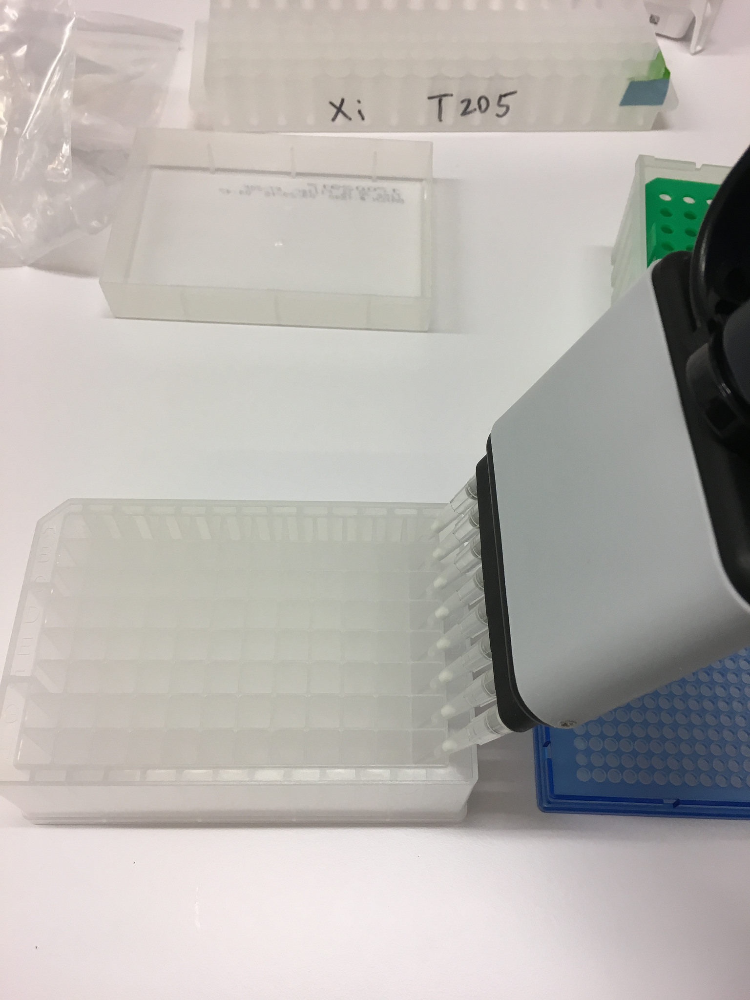

  * Altenatively, you can use a plate reservoir, if you feel pipetting is too much for you. We used [this one from Clickbio](https://www.click-bio.com/product-page/vblok200). This does save a lot of effort by simple centrifugation, like this:

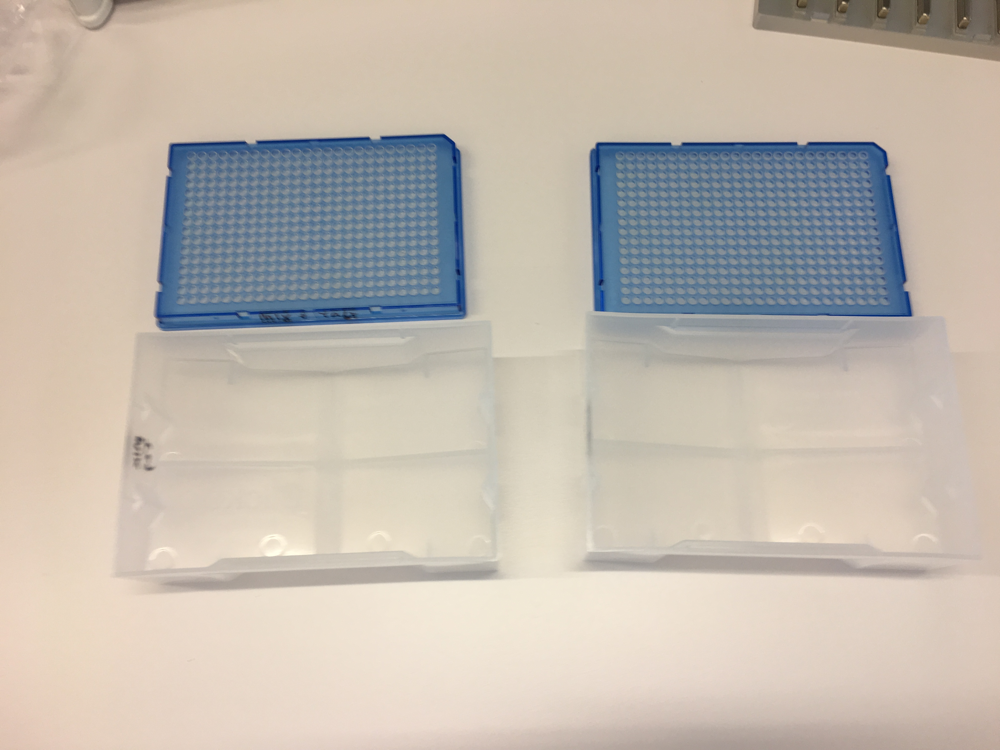 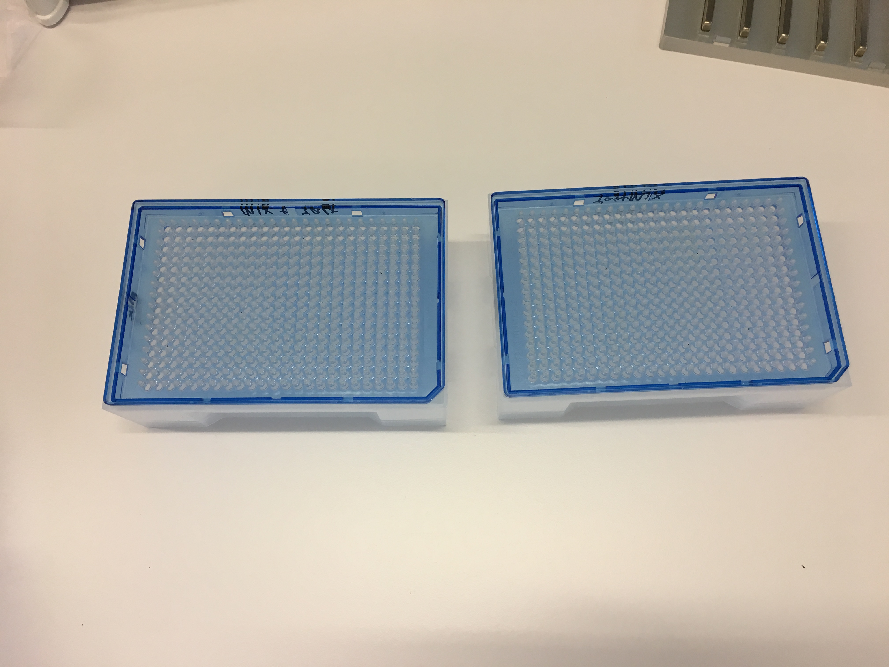

  * After centrifugation (we did 1,000xg for 1 minute), transfer the ~7.2 ml library mix to a 50 ml falcon tube. Add 36 ml Buffer PB (5 volume). The full volume is too large for a Qiagen MinElute column, you have two choices. You can use the Exntender Tube from the Qiagen Maxiprep kit  
  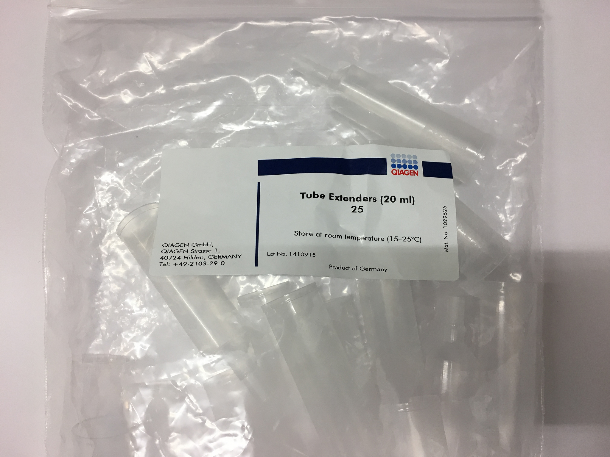  
  However, Qiagen don't sell that separately. If you don't have spare ones, you can punch a hole at the bottom of a 50 ml falcon tube using a SAFE method (don't hurt yourself!!!), like this:  
  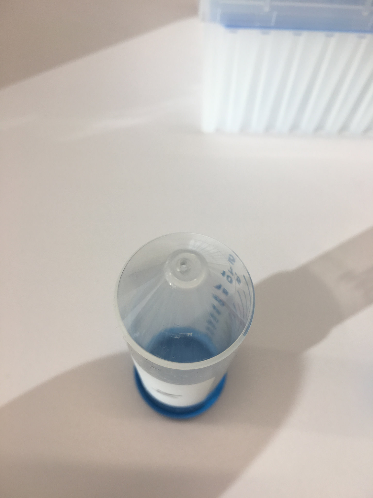  
  Then, you cut the cap of the MinElute column and use parafilm to seal the falcon to the column like this:  
  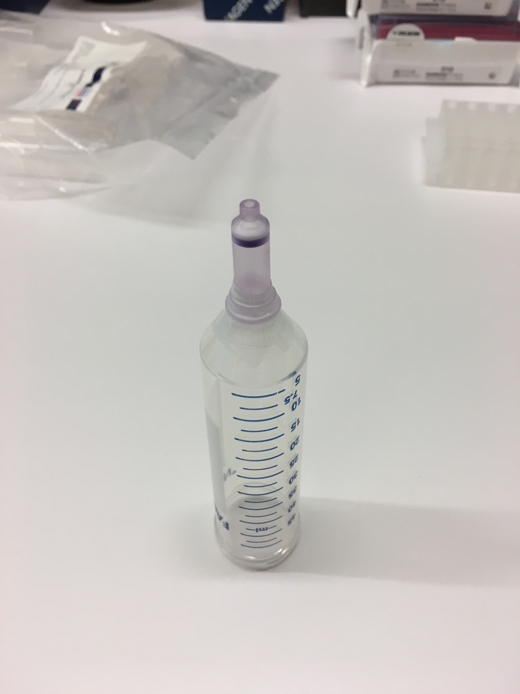  
  Now you can connect the column to the vacuum, and pour your libray mix on top, like this:  
  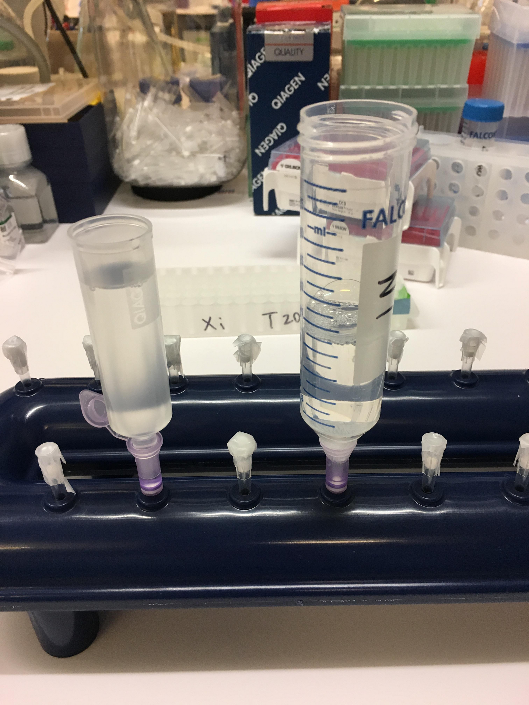  
  It will take a while for the whole volume to go through the column, so you can just leave it and go doing other experiments or drinking coffee.  
  
## Some descriptive plots

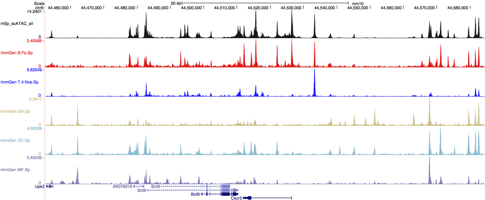

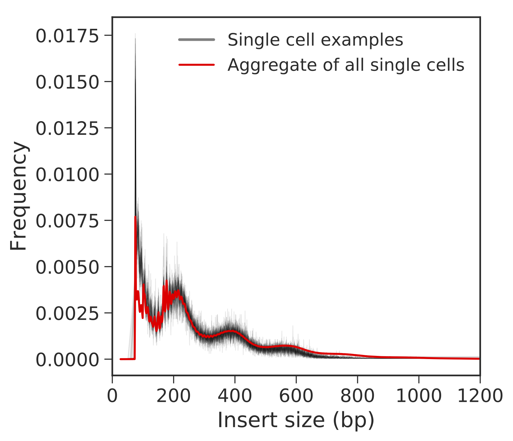

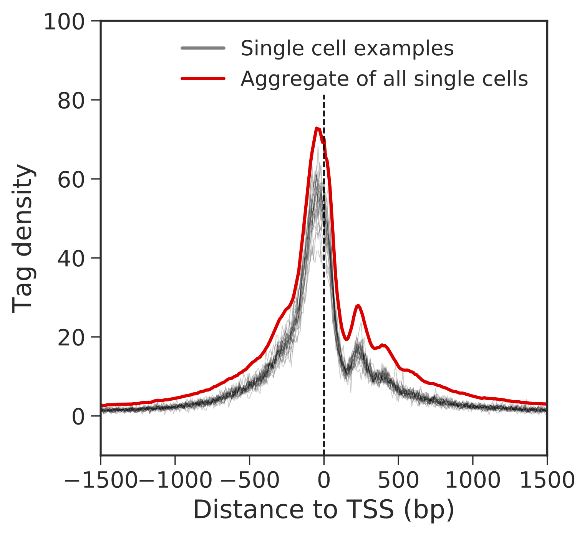

# Contact
Xi Chen  
chenx9@sustech.edu.cn
